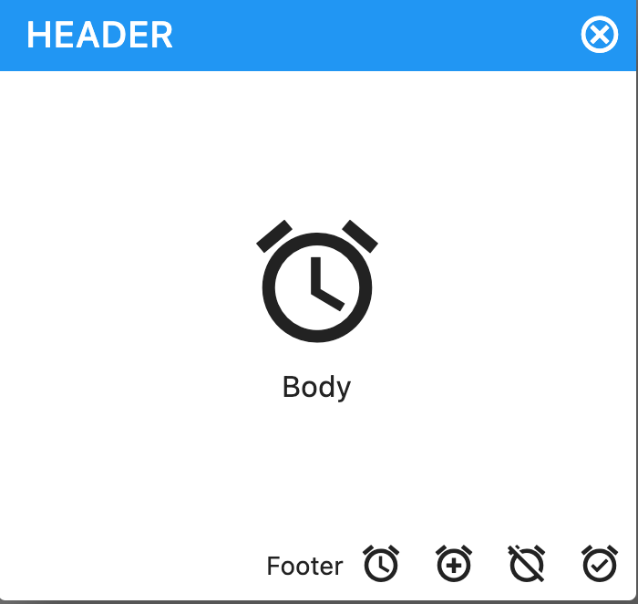

# Dialog Template
The dialog should be used inside an onPressed function.

    void dialogHeaderBodyFooter(BuildContext context,Color colorHeaderBackground,Widget title,Color colorClose,Widget body,List<Widget> inferiorButtons,double dialogHeight,double dialogWidth)

## Variables
Variables needed to call a dialog.

    BuildContext context: Context to build the dialog.
    Color colorClose: Color of the Icon to close the app.
    Color colorHeaderBackground: Color of the header background.
    double dialogHeight: Height of the dialog.
    double dialogWidth: Width of the dialog.
    List<Widget> inferiorButtons: Widgets that will be shown in the footer (icons, buttons, text, etc).
    Widget body: It is a widget that contains all body information (icons, buttons, text, etc).
    Widget title: It is a widget that is generally used to insert a title that appears in the header section.
    
